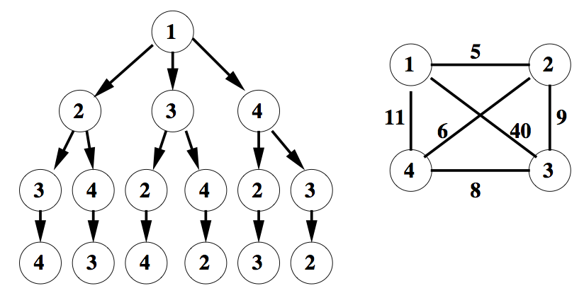

# Final Project

---

## Objectif

L'objectif de ce projet est double : un exercice et une évaluation. Dans ce projet, vous allez développer un programme qui profite d'une architecture multi-cœur, en utilisant les techniques définies durant le cours. Vous serez évalués par la qualité du programme développé.

Le travail consiste à résoudre le Problème du voyageur de commerce (TSP, Traveling Salesman Problem) avec une méthode branch-and-bound. En synthèse, vous devez visiter N villes une seule fois et revenir à la ville de départ, en faisant le chemin le plus court. Étant donné que le chemin est circulaire, le choix de la ville de départ n'a pas d'importance. Ceci est un problème difficile d'optimisation combinatoire, car s'il y a N villes alors, au départ d'une ville donnée, il y a (N-1)! circuits différents qui passent par les N-1 autres villes et reviennent à la ville de départ (nous supposons qu'il y a un chemin indépendant entre toute paire de villes).

L'entrée donnée au problème est une liste de villes, chacune avec ses coordonnées X et Y. Le programme lit la liste de villes et calcule une matrice de distances, dans laquelle l'élément D[K][L] est une distance de la ville K à la ville L. Par simplicité, nous supposons que les routes sont des lignes droites d'une ville à l'autre. La sortie du programme est une liste ordonnée de villes. Des solutions distinctes avec un chemin de même longueur sont équivalentes.

## Branch-and-bound

Il existe un grand nombre de solutions au problème du TSP, nous allons travailler avec un algorithme dit par séparation et évaluation (branch-and-bound). Pour comprendre cet algorithme, considérer initialement une recherche exhaustive comme forme de résoudre le problème. Une façon simple de commencer est d'imaginer toutes les routes possibles à partir d'une ville donnée. La figure ci-dessous montre une carte avec 4 villes, et l'arbre de routes possibles correspondant, à partir de la ville 1.



Pour le problème ci-dessus, D[1][2]=5, D[1][3]=40, D[1][4]=11, D[2][3]=9, D[2][4]=6 e D[3][4]=8. Nous pouvons retrouver tous les parcours possibles en partant de la racine de l'arbre, suivi de trois déplacements. Par exemple, si l'on prend la branche du milieu à la première ville et la branche droite à la deuxième, nous avons le parcours 1 → 3 → 4 → 2, dont la distance totale est 54 (40+8+6). Il y a six (3!) parcours possibles en partant de la ville 1.

La recherche exhaustive de l'exemple donné se fait en calculant tous les six parcours possibles (de la racine aux feuilles de l'arbre). Le parcours ayant la plus petite addition de toutes les distances est la solution du problème.

Le parcours de l'arbre est naturellement récursif. Nous pouvons réutiliser la distance de la racine à une ville donnée pour calculer les distances de tous les parcours qui partent de cette ville (inutile de la recalculer). L'approche branch-and-bound utilise cette formulation de façon intelligente pour supprimer les branches inutiles de l'arbre, de façon à diminuer le nombre de parcours à évaluer.

1. Évaluer un parcours entier de l'arbre. Prenons par exemple 1 → 2 → 3 → 4 et determinons la distance globale de ce parcours. Appelons cette distance la limite (bound) du problème. La limite du parcours proposé est 22 (5+9+8).

2. Ensuite, supposons qu'un deuxième parcours soit déjà partiellement évalué, par exemple 1 → 3, et que la distance partielle est déjà 40, donc plus grande que la limite actuelle. Si ceci est le cas, il est inutile de terminer le calcul de distance de tous chemins après la ville 3, car tous auront une longueur plus grande que 40. Grace à cette constatation, nous allons tailler la branche en question (prune) et nous ne ferons pas le calcul de toutes ses sous-branches.

3. Chaque fois qu'un nouveau parcours abouti et que sa longueur s'avère inférieure à la limite, on choisira ce nouveau parcours comme limite.

La méthode branch-and-bound se souvient toujours du meilleur parcours trouvé et l'utilise comme limite pour éviter de parcourir des branches de l'arbre qui ne produisent pas des meilleures solutions. Avec des grands arbres, cet algorithme peut éviter d'évaluer complètement un grand nombre de combinaisons.

En pièce jointe à cet enoncé, à titre d'exemple, vous trouverez un programme en C++ qui résout le TSP. Il utilise des fichiers d'entrée selon le format utilisé par une [batterie d'exemples](https://www.math.uwaterloo.ca/tsp/data/index.html) fournie par l'Université de Waterloo au Canada.

## Travail à exécuter

L'exemple fourni fonctionne de façon séquentielle et il est déjà écrit en language C++. Vous devez proposer une implémentation en C++ qui s'exécute en parallèle avec des threads POSIX (Pthreads) ou de threads de la STL de C++ (std::thread). La distribution du travail aux threads se fera par le biais d'une structure de données non bloquante. Vous devez démontrer votre implémentation avec une comparaison du temps d'exécution parallèle avec le temps séquentiel.

Pour démarrer, vous devez choisir un problème qui prend autour de 10-15 minutes en exécution séquentielle. Choisissez des exemples dans le site web de l'Université de Waterloo, éventuellement vous pouvez supprimer quelques éléments d'un des exemples pour ajuster la taille du problème.

Voici quelques pistes d'optimisation :

- Évaluer toutes les branches de l'arbre en parallèle.
- Comparer l'utilisation d'une limite par thread avec une limite pour tout le programme.
- Il y a peu d'intérêt d'optimiser les fonctions qui gèrent le graphe et les parcours (graph.c et path.c). Ne les modifiez qu'en cas de besoin d'implémentation, par exemple, lorsque vous les encapsulerez dans une classe en C++.

Le travail sera fait en équipes de deux personnes.

## Contraintes de d'implémentation

Les livrables de ce mini-projet seront utilisés pour donner la note de l'évaluation. Les contraintes ci-dessous sont importantes. Toute déviation par rapport à ces contraintes, même si elles peuvent donner des améliorations de performance, seront considérés comme négatives et diminueront la note de l'évaluation.

- Le problème du TSP doit être résolu par la même méthode du programme d'exemple (**branch-and-bound**).
- Vous devez implémenter une solution parallèle avec threads en C++ et qui utilise une **structure non-bloquante** comme structure de données partagée.
    - La structure partagée sera utilisée pour stocker des **tâches à exécuter**, qui seront traitées par un pool de threads de taille fixe.
        - Chaque thread du pool récupère des tâches de la structure partagée, et de nulle part ailleurs.
        - Un thread peut créer des nouvelles tâches et les rajouter das la structure.
    - Vous pouvez choisir la sémantique de cette structure et l'interface qu'elle implémente (file simple, pile, file multiple, etc).
    - La structure partagée devra aider à détecter la terminaison de la solution du problème
    - La structure partagée devra être **implementée par vos soins**, avec des instructions atomiques.
    - Vous devez probablement traiter le problème ABA lorsque vous implémentez votre structure partagée.
- Le programme doit se compiler avec GCC.
- Le programme doit fonctionner sous Linux, avec un nombre donné de threads (paramètre du programme).
- Le programme doit pouvoir utiliser **tous les cœurs disponibles** dans la machine Xeon Phi (256 threads).

## Évaluation de l'implémentation

Vous devez préparer des expériences qui génèrent de mesures de temps. Vous exécuterez votre programme plusieurs fois, chaque fois avec un nombre de threads diférent. Vous mesurerez le temps de chaque exécution. Idéalement, vous prendrez plusieurs mesures de temps pour chaque point. Avec ces mesures vous devez créer au moins deux graphes :

- Courbe de speed-up en fonction du nombre de threads/cœurs utilisés
- Courbe d’efficience en fonction du nombre de threads/cœurs utilisés

Les graphes auront la forme ci-dessours, et devront être générés avec Gnuplot ou un autre logiciel libre, présentés en PDF. Ces graphes seront expliqués dans le rapport écrit.


## Objets à rendre

Le travail rendu devra contenir :

- Les sources des programmes développés, avec un script de nom "do-it" dans le répertoire principal, qui compile le tout et qui exécute tous les tests.
- Un rapport
- Un formulaire d'auto-évaluation (il sera fourni plus tard).

## Contenu et format du rapport

Le rapport livré contiendra 5 ou 6 pages A4 en PDF, police de taille 12. Des fichiers Word ne seront pas acceptés !

Le rapport aura:

- Une introduction mentionant les idées de base et un résumé des résultats sans donner des chiffres précis.
- Une présentation des implémentations développées
    - On doit expliquer pourquoi le code est tel qu'il est, les raisons des choix.
    - Votre analyse doit au moins indiquer la décomposition du problème, sa structure et l'identification du parallélisme.
- Une présentation des expériences faites et des mesures de performance collectées.
    - Vous devez discuter à propos de la taille idéale de problème (nombre de villes) pour l'environnement utilisé lors des expériences.
    - Vous devez présenter les résultats de performance avec les graphes demandés (speedup et efficience).
- Une conclusion rapellant les avantages des choix faits et quelques propositions d'amélioration.

## Formation des groupes
Vous devez former des groupes de 2 personnes. Envoyer un email à marcelo.pasin@he-arc.ch les groupes formés, avec :

- Le nom des composants du groupe
- Une clé publique SSH du type ssh-ed25519 par étudiant, pour l'accès aux machines Xeon Phi

## Infrastructure de calcul
Vos devez impérativement utiliser les Xeon Phi (phi-1 et phi-2) mis à disposition par l'enseignant.

Vous recevrez un email avec votre nom-du-compte dans les machines Xeon Phi et un fichier cle-proxy contenant une clé privée pour le proxy. Copier le fichier cle-proxy dans vos répertoires ~/.ssh et rajouter les lignes suivantes dans vos fichiers ~/.ssh/config:

```
Host iiun-cluster
   Hostname      clusterinfo.unineuchatel.ch
   User          pasin-pcm-2024
   IdentitiesOnly yes
   IdentityFile  /VOTRE-HOME-DIR/.ssh/cle-proxy

Host *.maas
   User          nom-du-compte
   StrictHostKeyChecking no
   ForwardAgent  yes
   ProxyJump     iiun-cluster
   IdentityFile  /VOTRE-HOME-DIR/.ssh/VOTRE-CLE-PRIVEE-SSH
```

Une fois votre fichier de configuration préparé, connecter aux machines (phi-1 et phi-2) avec la commande:

`bash% ssh phi-1.maas`

Un [CALENDRIER DE RÉSERVATION](https://docs.google.com/spreadsheets/d/1qwOKXMd4OwLue7iKwUVILkxLKSMsos1sH5iW_b5hE7Q/edit?gid=0#gid=0) est à la disposition des étudiants, pour réserver les machines. Losque vous mesurerez les temps d'exécution, vous devrez être seul(e)s sur les machines, pour être sur(e)s que vous utilisez les cœurs ce façon adéquate.

## Échéanchier
25 novembre 2024 : donnée du projet
2 décembre 2024 : design prêt, premiers bouts de code (discussion en classe des premiers résultats)
9 décembre 2024 : développement prêt, début d'évaluation, esquisse du rapport
16 décembre 2024 : discussion des projets en classe (présentations informelles, 10-20 min par groupe)
6 janvier 2024 : rendu des projets (23h)